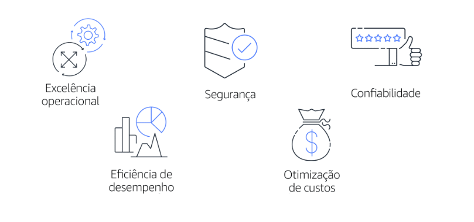

# AWS Well-Architected Framework

ajuda você a entender como projetar e operar sistemas confiáveis, seguros, eficientes e econômicos na nuvem AWS. Com ele, é possível avaliar de forma consistente suas arquiteturas em relação às melhores práticas e aos princípios de projeto e a identificar áreas para melhorias.

O Well-Architected Framework se baseia em cinco pilares: 

## Excelência operacional
Capacidade de executar e monitorar sistemas para entregar valor comercial e melhorar continuamente os processos e procedimentos de apoio.

Os princípios de design para a excelência operacional na nuvem incluem executar operações como código, anotar documentação, antecipar falhas e fazer frequentemente alterações pequenas e reversíveis.

## Segurança
capacidade de proteger informações, sistemas e ativos e, ao mesmo tempo, entregar valor comercial por meio de avaliações de risco e estratégias de mitigação.

Ao considerar a segurança de sua arquitetura, aplique estas melhores práticas:

- Automatize as melhores práticas de segurança quando possível.
- Aplique segurança em todas as camadas.
- Proteja os dados em trânsito e em repouso.

## Confiabilidade
capacidade de um sistema fazer o seguinte:

- Recuperar-se de interrupções na infraestrutura ou no serviço
- Adquirir dinamicamente recursos de computação para atender à demanda
- Reduzir interrupções, como configurações incorretas ou problemas de rede transitórios
- A confiabilidade inclui testes de procedimentos de recuperação, scaling horizontal para aumentar a disponibilidade agregada do sistema e recuperação automática de falhas.

## Eficiência de desempenho
Capacidade de usar recursos computacionais com eficiência para cumprir requisitos do sistema e manter essa eficiência à medida que a demanda muda e as tecnologias evoluem.

A avaliação da eficiência de desempenho de sua arquitetura inclui experimentar com mais frequência, usar arquiteturas sem servidor e projetar sistemas para ter alcance global em minutos.

## Otimização de custos
Capacidade de executar sistemas para entregar valor comercial com o menor preço.

A otimização de custos inclui a adoção de um modelo de consumo, análise e atribuição de despesas e uso de serviços gerenciados para reduzir o custo de propriedade.