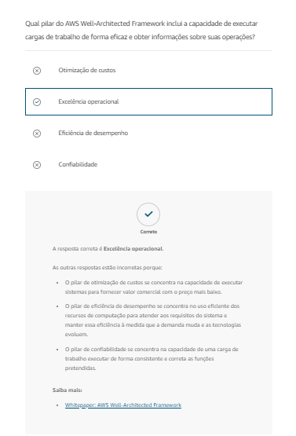
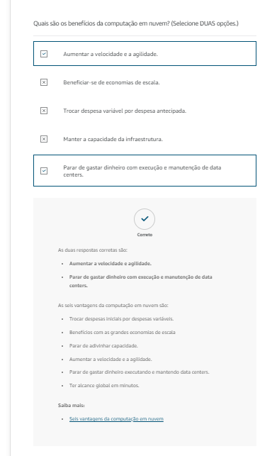

# Questionário

# Recursos Adicionais

[AWS Well-Architected](https://aws.amazon.com/architecture/well-architected/?wa-lens-whitepapers.sort-by=item.additionalFields.sortDate&wa-lens-whitepapers.sort-order=desc&wa-guidance-whitepapers.sort-by=item.additionalFields.sortDate&wa-guidance-whitepapers.sort-order=desc)

[Whitepaper: AWS Well-Architected Framework](https://d1.awsstatic.com/whitepapers/architecture/AWS_Well-Architected_Framework.pdf)

[Central de arquitetura da AWS](https://aws.amazon.com/architecture/?cards-all.sort-by=item.additionalFields.sortDate&cards-all.sort-order=desc&awsf.content-type=*all&awsf.methodology=*all&awsf.tech-category=*all&awsf.industries=*all&awsf.business-category=*all)

[Seis vantagens da computação em nuvem](https://docs.aws.amazon.com/whitepapers/latest/aws-overview/six-advantages-of-cloud-computing.html)

[Blog de arquitetura da AWS](https://aws.amazon.com/blogs/architecture/)