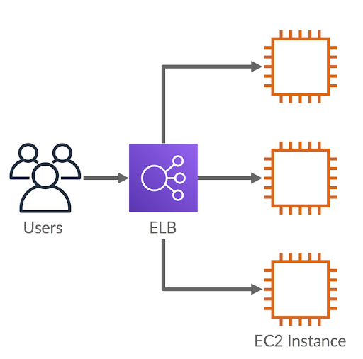

# Elastic Load Balance - Direcionando o Tráfego
Um balanceador de carga atua como um ponto único de contato para todo o tráfego da web de entrega no seu grupo do Auto Scaling

> ELB direciona os novos clientes para a caixa registradora disponível.

