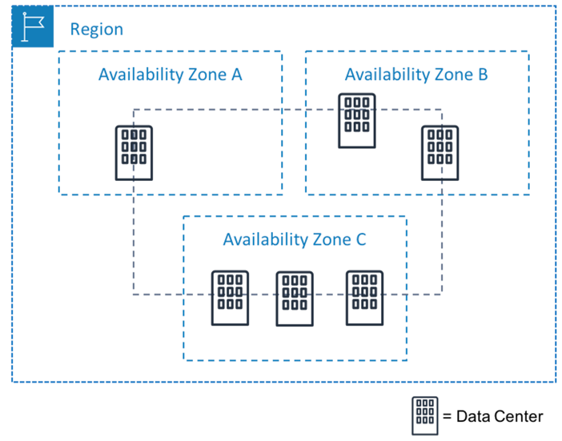

# 4 fatores para determinar uma região

## Conformidade com governança de dados e requisitos
Dependendo da sua empresa e localização. talvez seja necessário executar seus dados em áreas específicas.

## Proximidade com os clientes
Selecionar uma região mais próxima dos clientes ajudará voce a obter o conteúdo com mais rapidez

## Serviços disponíveis em uma região
As vezes a região mais proxima pode nao ter todos os recursos que voce deseja oferecer

## Definição dos preços
Custo pode variar entre as regiões

---

# Zona de disponibilidade
Uma zona de disponibilidade é um único data center ou um grupo em uma região

## Falha na zona de disponibilidade
Uma prática recomendada é executar aplicativos em pelo menos duas zonas de disponibilidade em uma região