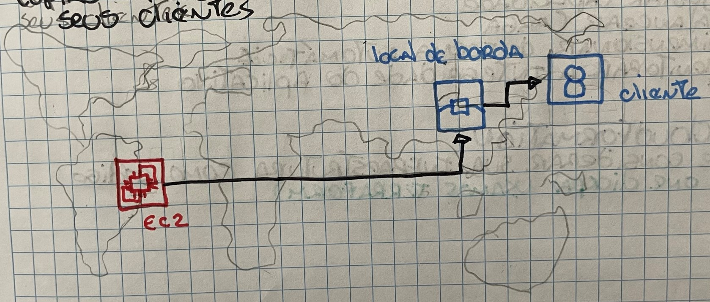

# Local de Borda
é um site que o Amazon Cloudfront usa para armazenar cópias em cache do seu conteúdo mais próximo dos seus clientes.

Como interagir com esses serviços? Na AWS, tudo é uma chamada de API.

Significa que há maneiras pré-determinadas de interagir com o serviço da AWS

## AWS Management Console
Interface baseada na web para acessar e gerenciar os serviços AWS

## AWS Comand Line Interface (AWS CLI)
Permite que voce controle vários serviços AWS diretamente a partir da linha de comando em uma ferramenta

## Kit de desenvolvimento de Software (SDK's)
Permite que voce use serviços AWS com seus aplicativos existentes ou crie aplicativos totalmente novos que serão executados na AWS