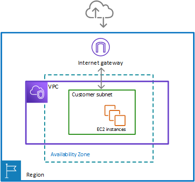
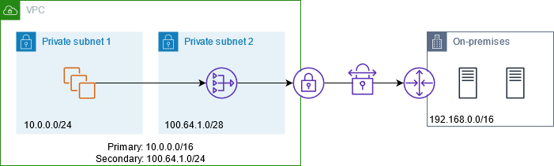
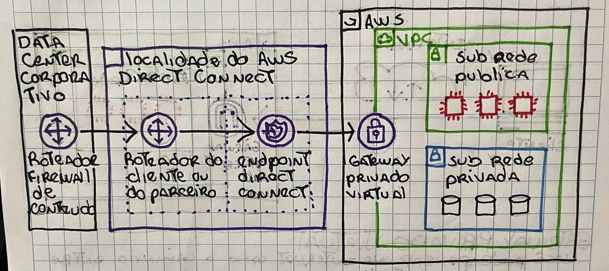

# Gateway da Internet
Para permitir o tráfego público da internet acesse sua VPC, é preciso anexar um gateway da internet a VPC.

# Gateway Privado Virtual
Você pode pensar na internet como o caminho entre sua casa e a cafeteria.  
Suponha que você esteja viajando com um guarda-costa.

O guarda-costas é como uma conexão de **rede privada virtual (VPN)**

O gateway privado virtual é o componente que permite que o tráfego protegido da internet ingresse na VPC.

>O gateway privado Virtual permitirá o tráfego na VPC somente se ele for proveniente de uma rede aprovada

# AWS Direct Connect
permite estabelecer uma conexão privada dedicada entre seu data center e uma VPC.

## Sub-redes Públicas
Contém recursos que precisam ser acessíveis ao público, como o site uma loja online.

## Sub-redes Privadas
Contém recursos que devem ser acessíveis apenas pela sua rede privada, como um banco de dados, contendo informações pessoais.

Solicitações são enviadas como **pacotes**.

>Pacote é uma unidade de dados enviada pela internet ou por uma rede.
