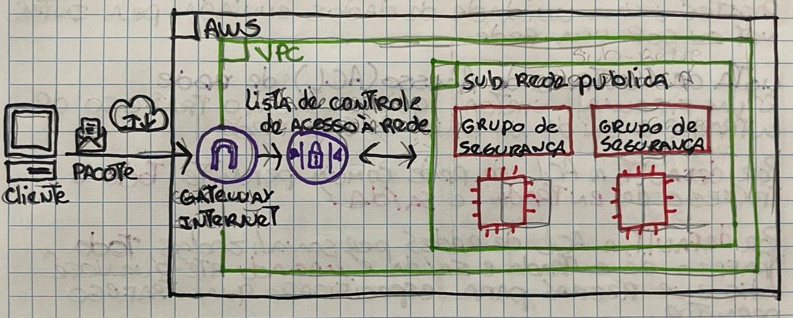
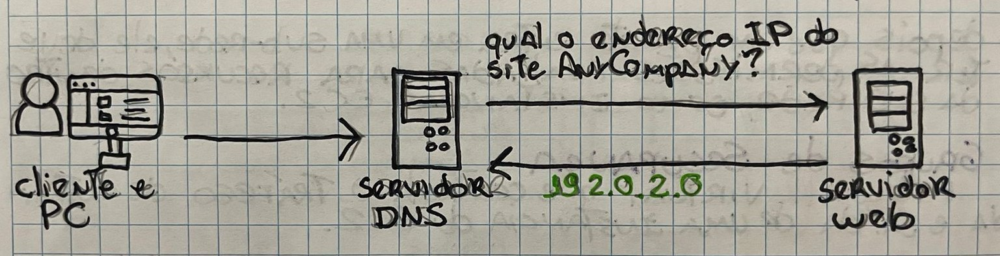
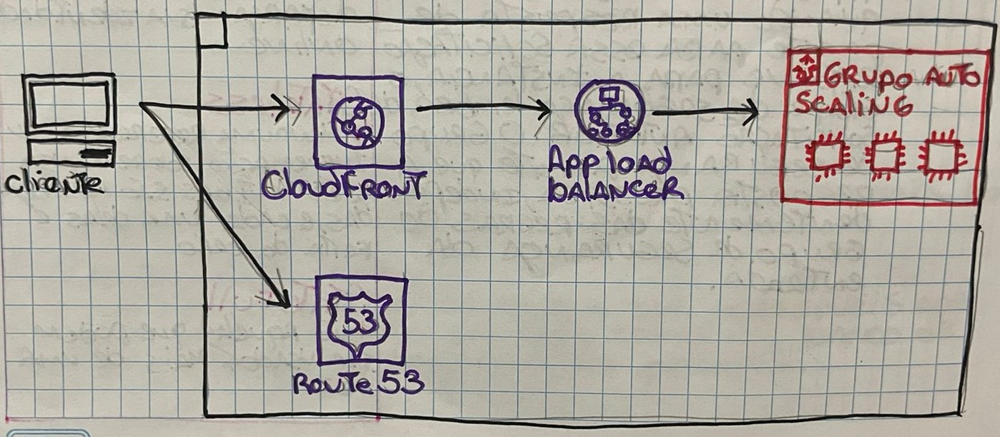

# Lista de controle de Acesso (ACL) de rede
É um firewall virtual que controla o tráfego de entrada e saída no nível de sub-rede.

Por **default**, a ACL de **redes comuns** permite **todo** o tráfego de **entrada** e **saída**.

Por **default**, a ACL de **redes personalizadas**, **todo** tráfego de **entrada e saída** é **negado** até que você adicione **regras** para especificar qual trafego permitir.

## Filtragem de pacotes Stateless
Verificam os pacotes que atravessam a fronteira da sub-rede em todos os sentidos: Entrada e saída

Depois que um pacote entra em uma sub-rede, ele deve ter as permissões avaliadas para recursos dentro da sub-rede, como instancias EC2.

### Grupos de Segurança
Firewall virtual que controla o tráfego de entrada e saída de uma instância do EC2

Por **default**, um **grupo de segurança** **nega** todo o tráfego de **entrada** e **permite** todo o tráfego de **saída**.

### Filtragem de pacotes Stateful
Quando uma resposta de pacote para essa solicitação retorna para a instancia o grupo de segurança lembra da solicitação anterior. O grupo de segurança permite que a resposta prossiga independente das regras do grupo de segurança da entrada.

## DNS - Domain Name System
A resolução de DNS é o processo de conversão de um nome de domínio para o endereço IP

## Amazon Route 53
Serviço web de DNS

---

**VPN** -> Virtual Private Network. Criptografam seu tráfego de internet e disfarçam sua identidade online.

**Stateless** -> Nenhuma referencia ou informação sobre transações antigas sobre armazenadas e, cada uma delas é feita do zero.

**Stateful** -> São aquelas que podem ser usadas mais de uma vez.