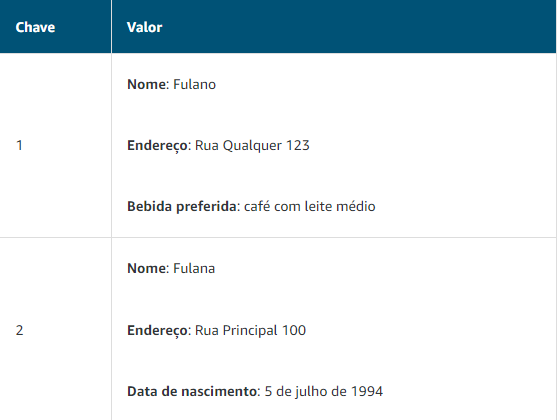

# Banco de Dados Não Relacional (NoSQL)

Em um banco de dados não relacional, você cria tabelas.  
Uma tabela é um lugar onde você armazena e consulta dados.

São chamados de **NoSQL** pois usam estruturas diferentes para organizar dados. Um tipo de abordagem estrutural é o uso de pares de chave-valor.

Em um banco de dados de chave-valor, você pode adicionar ou remover atributos de itens na tabela a qualquer momento. Além disso, nem todos os itens na tabela precisam ter os mesmos atributos. 

