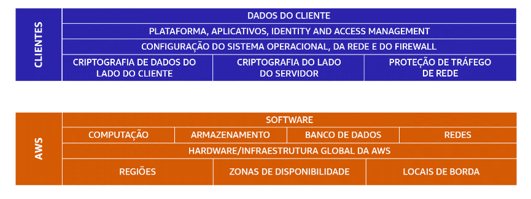

#  Modelo de responsabilidade compartilhada

O modelo de responsabilidade compartilhada divide-se em:

- **responsabilidades do cliente** (*comumente chamadas de “segurança na nuvem”*) e 

- **responsabilidades da AWS** (*comumente referidas como “segurança da nuvem”*).

## clientes: Segurança na nuvem

> Os clientes são responsáveis pela segurança de tudo o que criam e colocam na nuvem AWS.
>
> Ao usar os serviços AWS, você, o cliente, mantém controle total sobre seu conteúdo. Você é responsável por gerenciar os requisitos de segurança para seu conteúdo, incluindo qual conteúdo você escolhe armazenar na AWS, quais serviços AWS você usa e quem tem acesso a esse conteúdo. Você também controla como os direitos de acesso são concedidos, gerenciados e revogados.
>
> As etapas de segurança que você executar dependerão de fatores como os serviços que usa, a complexidade de seus sistemas e as necessidades operacionais e de segurança específicas de sua empresa. As etapas são seleção, configuração e aplicação de patches nos sistemas operacionais que serão executados nas instâncias do Amazon EC2, configuração de grupos de segurança e gerenciamento de contas de usuário.

## AWS: Segurança da Nuvem

> A AWS é responsável pela segurança da nuvem.
> 
> A AWS opera, gerencia e controla os componentes em todas as camadas da infraestrutura. Isso inclui áreas como o sistema operacional do host, a camada de virtualização e até mesmo a segurança física do data center no qual o serviço opera.
>
> 
> A AWS é responsável pela proteção da infraestrutura global que executa todos os serviços oferecidos na nuvem AWS. A infraestrutura inclui Regiões AWS, Zonas de Disponibilidade e locais de borda.
>
>A AWS gerencia a segurança da nuvem, especificamente a infraestrutura física que hospeda seus recursos, que incluem:
>
> - Segurança física dos data centers
> - Infraestrutura de hardware e software
> - Infraestrutura de rede
> - Infraestrutura de virtualização
> - Embora você não possa visitar os data centers da AWS para ver essa proteção pessoalmente, a AWS fornece vários relatórios de auditores terceirizados. Esses auditores verificaram a conformidade com diversas normas e regulamentações de segurança da computação.