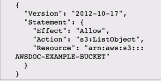
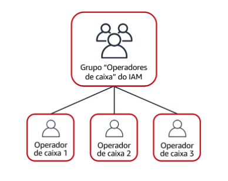

# AWS identity and Access Management (IAM)

Permite que voce gerencie o acesso aos serviços e recursos AWS com segurança.

## Usuário raiz da conta AWS (ROOT)

Ao criar uma conta AWS pela primeira vez, voce começa com uma identidade conhecida como usuário ROOT.

Ele é acessado ao entrar com email e senha usados para criar a conta. ele tem acesso completo a todos os serviços e recursos AWS na conta

> ### Prática recomendada:
> Não use o usuário-raiz para tarefas cotidianas.
>
> Em vez disso, use o usuário-raiz para criar seu primeiro usuário do IAM e > atribua a ele permissões para criar outros usuários.
> 
> Em seguida, continue a criar outros usuários do IAM e acesse essas identidades para executar tarefas comuns em toda a AWS. Use o usuário-raiz somente quando precisar executar um número limitado de tarefas disponíveis somente para o usuário-raiz. Exemplos dessas tarefas são a alteração do endereço de e-mail do usuário-raiz e a alteração do plano do AWS Support.

## Usuário IAM
É uma identidade que voce na AWS. Representa a pessoa ou app que interage com os serviços e recursos AWS.  
Consiste em um **nome** e **credenciais**

> ### Prática recomendada:
> Recomendamos que crie usuários individuais do IAM para cada pessoa que precisa acessar a AWS.  
>
> Mesmo que você tenha vários funcionários que precisem do mesmo nível de acesso, você deve criar usuários individuais do IAM para cada um deles. Isso fornece segurança adicional, permitindo que cada usuário do IAM tenha um conjunto exclusivo de credenciais de segurança.
---
## Politicas do IAM
Documento que concede ou nega permissões para serviços e recursos AWS.

As políticas do IAM permitem que você personalize os níveis de acesso dos usuários aos recursos.

> ### Prática recomendada:
> Siga o princípio de segurança de menor privilégio ao conceder permissões.
>
> Seguindo esse princípio, você ajuda a impedir que usuários ou funções tenham mais permissões do que o necessário para executar as tarefas.
>
> Por exemplo, se um funcionário precisar acessar apenas um bucket específico, especifique o bucket na política do IAM. Faça isso em vez de conceder ao  funcionário acesso a todos os buckets em sua conta AWS. 

Nesse exemplo, a política do IAM permite uma ação específica no Amazon S3: **ListObject**.  
A política também menciona o ID de bucket específico: **AWSDOC-EXAMPLE-BUCKET**. Quando o proprietário associa essa política ao usuário do IAM do operador de caixa, ele permitirá que ele visualize todos os objetos no bucket **AWSDOC-EXAMPLE-BUCKET**.

---

## Grupos do IAM
É um conjunto de usuários do IAM. Ao atribuir uma política do IAM em grupo, todos os usuários do grupo recebem permissões específicas pela política.

---
## Funções do IAM
Uma função do IAM é uma identidade que você pode assumir para obter acesso temporário a permissões.

> ### Prática recomendada:
>
>As funções do IAM são ideais para situações em que o acesso a serviços ou recursos precisa ser concedido temporariamente, em vez de a longo prazo.  
---

## Autenticação multifator

No IAM, a autenticação multifator (MFA) fornece uma camada adicional de segurança para sua conta AWS.