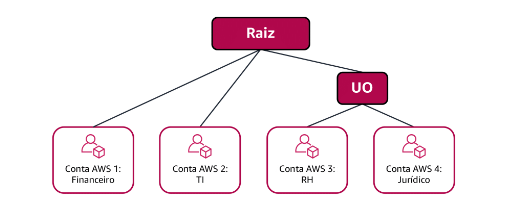

# AWS Organizations

Suponha que sua empresa tenha múltiplas contas AWS. Você pode usar o **AWS Organizations** para consolidar e gerenciar múltiplas contas AWS em um local central.

 você pode controlar de forma centralizada as permissões para as contas em sua organização usando as **políticas de controle de serviço (SCPs)**. Elas permitem que voce coloque restrições nos serviços AWS, recursos e ações individuais de API que os usuários e  funções em cada conta que podem acessar.

 ### Unidades organizacionais

 você pode agrupar contas em **unidades organizacionais** (UO) para facilitar o gerenciamento de contas com requisitos de negócios ou segurança semelhantes. Ao aplicar uma política a uma UO, todas as contas na UO herdam automaticamente as permissões especificadas na política.  

