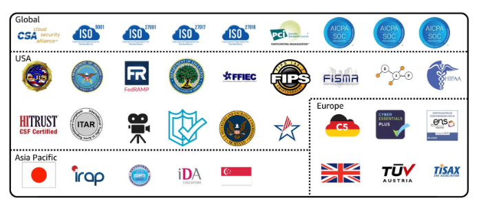

# Artifact
Serviço que fornece acesso sob demanda a relatórios de segurança e conformidade da AWS e a contratos on-lines selecionados.  
Tem duas seções principais:

## AWS Artifact Agreements

> Suponha que sua empresa precise assinar um contrato com a AWS em relação ao uso de determinados tipos de informações em todos os serviços AWS. Você pode fazer isso pelo AWS Artifact Agreements.

>No AWS Artifact Agreements, você pode revisar, aceitar e gerenciar contratos para uma conta individual e para todas as suas contas no AWS Organizations. Diferentes tipos de acordos são oferecidos para atender às necessidades dos clientes sujeitos a regulamentações específicas, como a Lei de Portabilidade e Responsabilidade dos Provedores de Saúde dos EUA (HIPAA).

## AWS Artifact Reports

>Suponha que um membro da equipe de desenvolvimento da sua empresa esteja criando um aplicativo e precise de mais informações sobre a responsabilidade em cumprir determinados padrões regulatórios. Você pode recomendar o acesso a essas informações em AWS Artifact Reports.

>O AWS Artifact Reports fornece relatórios de conformidade por auditores terceirizados. Esses auditores testaram e verificaram se a AWS está em conformidade com diversas normas e regulamentações de segurança globais, regionais e específicas do setor. O AWS Artifact Reports se mantém atualizado com os relatórios publicados mais recentes. Você pode fornecer os artefatos de auditoria da AWS aos auditores ou reguladores como evidência dos controles de segurança da AWS.

---

## Centro de conformidade para o cliente
Contém recursos que ajudam você a saber mais sobre a conformidade da AWS.

Você pode ler histórias de conformidade dos clientes para descobrir como as empresas de setores regulamentados resolveram vários desafios de conformidade, governança e auditoria.
