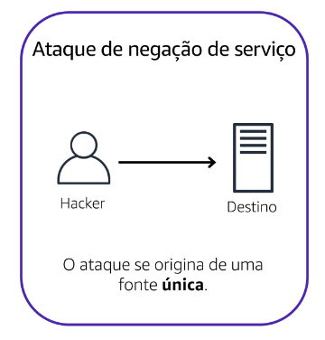

# Ataque de negação de serviço (DoS)
 é uma tentativa deliberada de tornar um site ou aplicativo indisponível para os usuários.

# Ataques distribuídos de negação de serviço (DDoS)
 várias fontes são usadas para iniciar um ataque que visa tornar um site ou aplicativo indisponível. O ataque pode ser feito por um grupo de invasores, ou até mesmo um único invasor.

## AWS Shield
Serviço que protege aplicativos contra ataques DDos. Oferece dois tipos de proteção

### AWS Shield Standard
Protege automaticamente todos os clientes AWS sem nenhum custo.

###  AWS Shield Advanced
Serviço pago que fornece diagnósticos detalhados de ataques e a capacidade de detectar e mitigar ataques elaborados de DDos.
