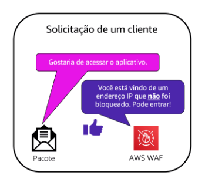
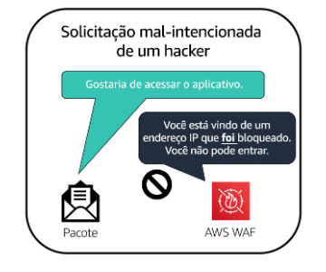
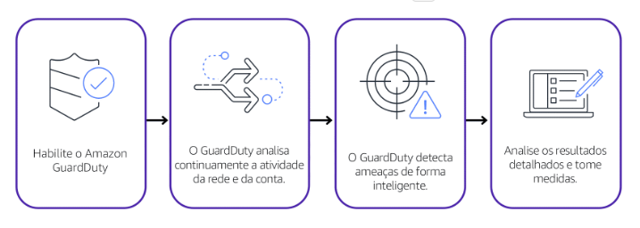

# AWS Key Management Service (AWS KMS)
permite que você execute operações de criptografia pelo uso de **chaves de criptografia**

Você pode usar o AWS KMS para criar, gerenciar e usar chaves de criptografia. Você também pode controlar o uso de chaves em uma ampla gama de serviços e em seus aplicativos.

# AWS WAF
firewall de aplicativo web que permite monitorar solicitações de rede que entram em seus aplicativos web. 

O AWS WAF trabalha em conjunto com o **Amazon CloudFront** e um balanceador de carga de aplicativo.  
O AWS WAF funciona de forma semelhante para bloquear ou permitir o tráfego. No entanto, ele faz isso usando uma lista de controle de acesso (ACL) da web para proteger seus recursos AWS. 

# Amazon Inspector
O Amazon Inspector ajuda a melhorar a segurança e a conformidade dos aplicativos executando avaliações de segurança automatizadas. Ele verifica os aplicativos quanto a vulnerabilidades de segurança e desvios das práticas recomendadas de segurança, como acesso aberto a instâncias do Amazon EC2 e instalações de versões de software vulneráveis. 

# Amazon GuardDuty
 serviço que fornece detecção inteligente de ameaças para sua infraestrutura e seus recursos AWS. Ele identifica ameaças monitorando continuamente a atividade da rede e o comportamento da conta no seu ambiente AWS.

 