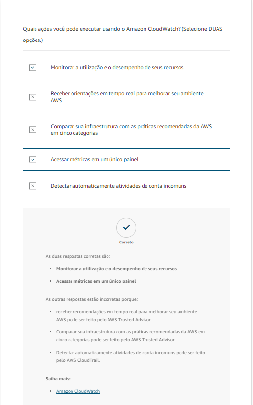
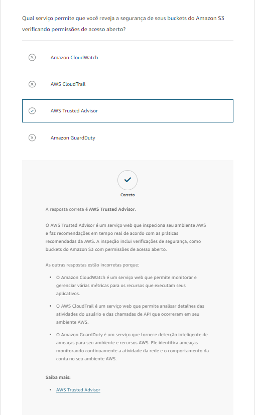
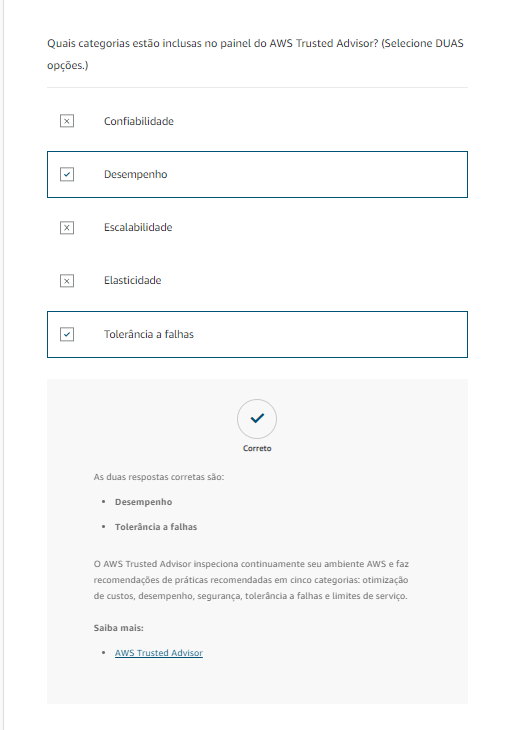

# Questionário

# Recursos adicionais

[Gerenciamento e governança na AWS](https://aws.amazon.com/products/management-and-governance/)

[Monitoramento e observabilidade](https://aws.amazon.com/cloudops/monitoring-and-observability/?whats-new-cards.sort-by=item.additionalFields.postDateTime&whats-new-cards.sort-order=desc&blog-posts-cards.sort-by=item.additionalFields.createdDate&blog-posts-cards.sort-order=desc)

[Configuração, conformidade e auditoria](https://aws.amazon.com/cloudops/compliance-and-auditing/?whats-new-cards.sort-by=item.additionalFields.postDateTime&whats-new-cards.sort-order=desc&blog-posts-cards.sort-by=item.additionalFields.createdDate&blog-posts-cards.sort-order=desc)

[Blog de gerenciamento e governança da AWS](https://aws.amazon.com/blogs/mt/)

[Whitepaper: AWS Governance at Scale](https://docs.aws.amazon.com/whitepapers/latest/aws-governance-at-scale/aws-governance-at-scale.html)

