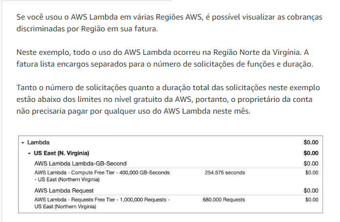

# Conceitos de definição de preço da AWS

## Pague somente pelo que usar
Para cada serviço, você paga exatamente a quantidade de recursos que realmente usa, sem exigir contratos de longo prazo ou licenciamento complexo. 

## Pague menos ao fazer reserva
Alguns serviços oferecem opções de reserva com desconto significativo em comparação com as definições de preços da instância sob demanda.

## Pague menos com descontos baseados em volume, quando usar mais
Alguns serviços oferecem definição de preço em camadas, portanto, o custo por unidade é incrementalmente menor com o aumento do uso.

Por exemplo, quanto mais espaço de armazenamento do Amazon S3 você usar, menos pagará por GB.

---

## Calculadora de preços AWS
[Calculadora](https://calculator.aws/#/)

permite explorar os serviços AWS e gerar uma estimativa de custo de seus casos de uso na AWS.  
Depois de criar uma estimativa, você pode salvá-la e gerar um link para compartilhá-la com outras pessoas.

---

## Exemplos de definição de preços AWS

### AWS Lambda
Para o AWS Lambda, a cobrança é feita com base no número de solicitações das funções e no tempo necessário para serem executadas.

Você pode economizar nos custos do AWS Lambda inscrevendo-se em um Compute **Savings Plan**

