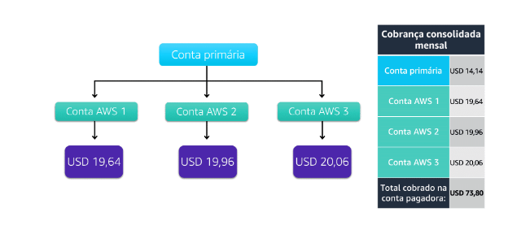

# Faturamento Consolidado

O recurso de cobrança consolidada do **AWS Organizations** permite que você receba uma **única fatura** para todas as contas AWS de sua organização.  
Ao consolidar, você pode rastrear facilmente os custos combinados de todas as contas vinculadas em sua organização.  
O número máximo de contas permitido para uma organização é **quatro**, mas você pode entrar em contato com o AWS Support para **aumentar sua cota**, se necessário.

