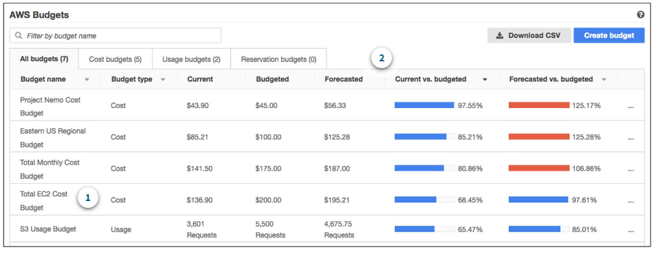

# AWS Budgets
Você pode criar orçamentos para planejar o uso do serviço, os custos de serviço e as reservas de instâncias.

No AWS Budgets, você também pode definir alertas personalizados para quando seu uso exceder (ou estiver prestes a exceder) o valor orçado.

## Exemplo

>Suponha que você tenha definido um orçamento para o Amazon EC2. Você deseja garantir que o uso do Amazon EC2 pela sua empresa não exceda USD 200 por mês. 
>
>No AWS Budgets, você pode definir um orçamento personalizado para notificação quando o uso atingir metade desse valor (USD 100). Essa configuração permite que você receba um alerta e decida como deseja prosseguir com o uso contínuo do Amazon EC2.

