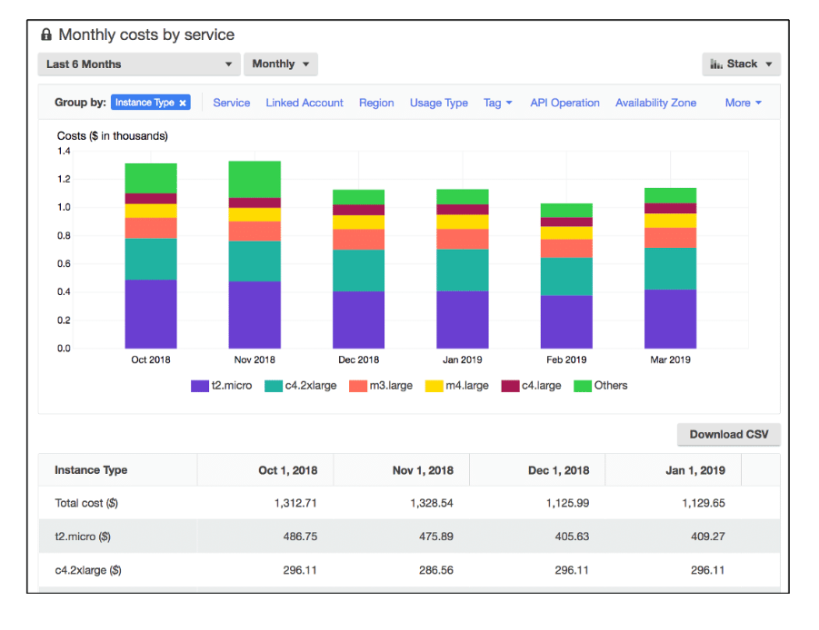

# Cost Explorer
É uma ferramenta que permite visualizar, interpretar e gerenciar seus custos e uso da AWS ao longo do tempo.

O AWS Cost Explorer inclui um relatório básico dos custos e do uso dos cinco principais serviços da AWS de acúmulo de custos.

