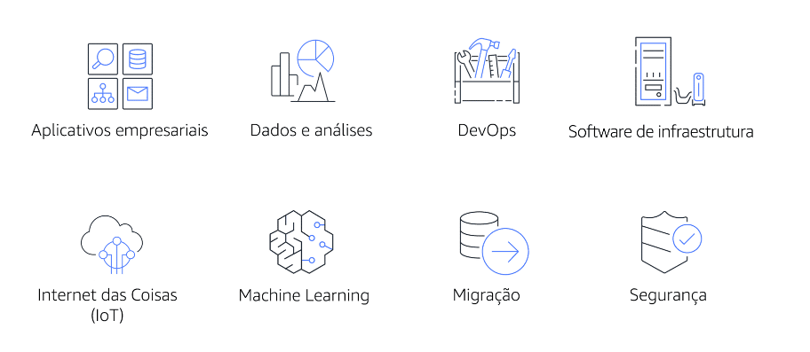

# AWS Marketplace
Catálogo digital com milhares de ofertas de fornecedores independentes de software. Você pode usar o AWS Marketplace para encontrar, testar e comprar software que pode ser executado na AWS. 

O AWS Marketplace oferece produtos em várias categorias, como produtos de infraestrutura, aplicativos de negócios, produtos de dados e DevOps.