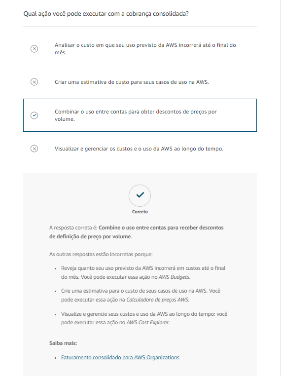
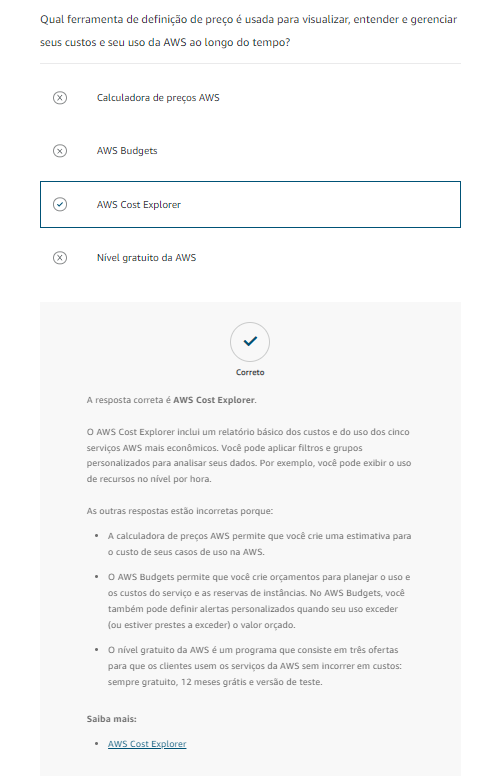
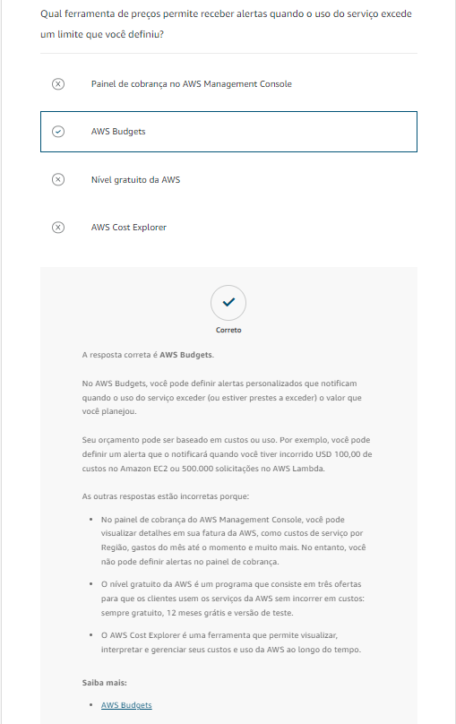
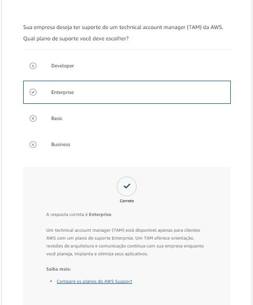

# Questionário

# Recursos Adicionais

[Definição de preços da AWS](https://aws.amazon.com/pricing/?aws-products-pricing.sort-by=item.additionalFields.productNameLowercase&aws-products-pricing.sort-order=asc&awsf.Free%20Tier%20Type=*all&awsf.tech-category=*all)

[Nível gratuito da AWS](https://aws.amazon.com/free/?all-free-tier.sort-by=item.additionalFields.SortRank&all-free-tier.sort-order=asc&awsf.Free%20Tier%20Types=*all&awsf.Free%20Tier%20Categories=*all)

[Gerenciamento de custos da AWS](https://aws.amazon.com/aws-cost-management/)

[Whitepaper: How AWS Pricing Works](https://d1.awsstatic.com/whitepapers/aws_pricing_overview.pdf)

[Whitepaper: Introduction to AWS Economics](https://d1.awsstatic.com/whitepapers/introduction-to-aws-cloud-economics-final.pdf)

[AWS Support](https://aws.amazon.com/premiumsupport/)

[Central de conhecimento da AWS](https://repost.aws/knowledge-center)