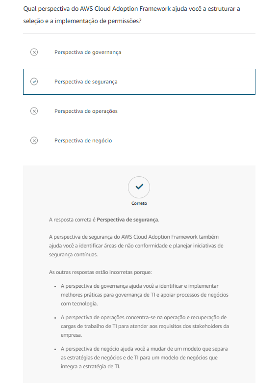
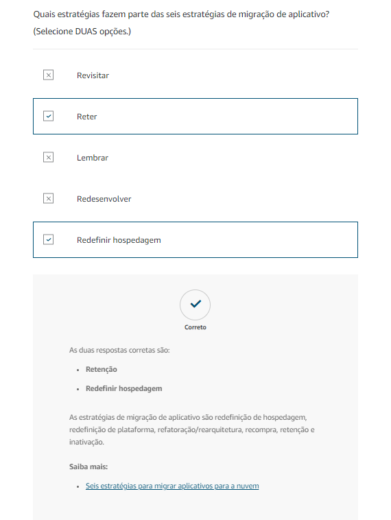
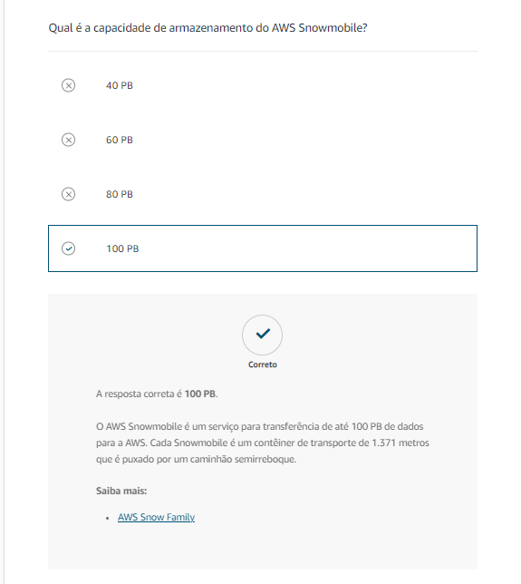
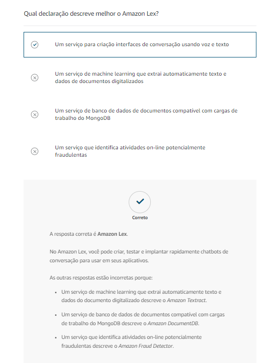

# Questionário

# recursos Adicionais

[Migração e transferência na AWS](https://aws.amazon.com/products/migration-and-transfer/)

[Um processo para migrações em massa para a nuvem](gs/enterprise-strategy/214-2/)

[Seis estratégias para a migração de aplicativos para a nuvem](https://aws.amazon.com/blogs/enterprise-strategy/6-strategies-for-migrating-applications-to-the-cloud/)

[AWS Cloud Adoption Framework](https://aws.amazon.com/professional-services/CAF/)

[Fundamentos da AWS: conceitos principais](https://aws.amazon.com/getting-started/cloud-essentials/)

[Blog de estratégia empresarial da nuvem AWS](https://aws.amazon.com/blogs/enterprise-strategy/)

[Blog de modernização com a AWS](https://aws.amazon.com/blogs/modernizing-with-aws/)

[Histórias de clientes da AWS: migração de data center](https://aws.amazon.com/solutions/case-studies/?customer-references-cards.sort-by=item.additionalFields.publishedDate&customer-references-cards.sort-order=desc&awsf.customer-references-location=*all&awsf.customer-references-segment=*all&awsf.customer-references-product=product%23vpc%7Cproduct%23api-gateway%7Cproduct%23cloudfront%7Cproduct%23route53%7Cproduct%23directconnect%7Cproduct%23elb&awsf.customer-references-category=category%23datacenter-migration&awsf.content-type=*all&awsf.customer-references-industry=*all&awsf.customer-references-use-case=*all&awsf.customer-references-tech-category=*all)