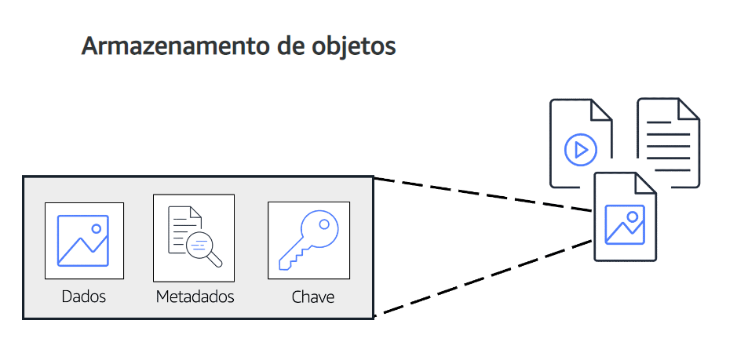
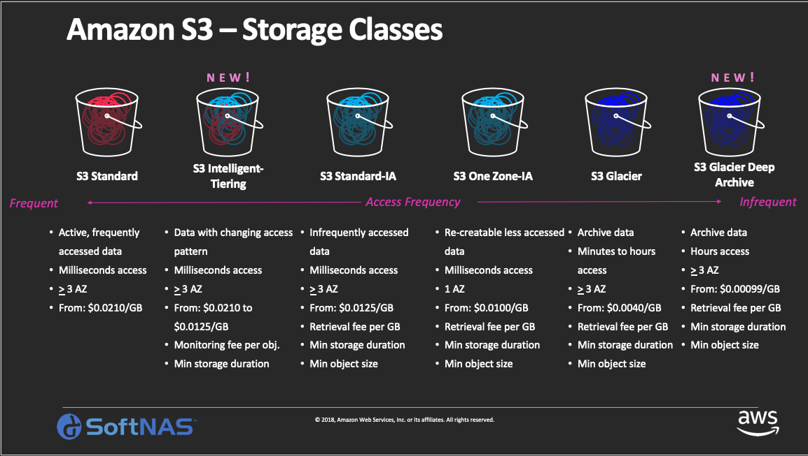

# Amazon Simple Storage Service (Amazon S3)

No armazenamento de objetos, cada objeto consiste em **dados** (*que podem ser imagens, documentos, vídeos*), **metadados** (*informações sobre o que são os dados, como são usados, tamanho do objeto*) e uma **chave** ( *que é seu identificador exclusivo*).

# Amazon Simple Storage Service (Amazon S3)

É um serviço que fornece armazenamento a nível do objeto. 
o S3 armazena dados como objetos em buckets.

O S3 oferece espaço de armazenamento ilimitado. O **tamanho máximo** de **arquivo** para um objeto no S3 é de **5TB**.

## Classes de Armazenamento do S3

No S3, você paga somente pelo o que usar.
Ao selecionar ma categoria, considere dois fatores:

- Com que frequência você planeja recuperar seus dados.
- Seus dados precisam estar muito ou pouco disponíveis.

### S3 Standard

- Projetado para dados acessados com frequência
- Armazena dados em um mínimo de três zonas de Disponibilidade
  
Alta disponibilidade para objetos. Custo mais alto do que outras categorias.

### S3 Standard-Infrequent Access (S3 Standard - IA)

- Ideal para dados com pouca frequência de acesso
- Semelhante ao Standard, com umn preço mais baixo e um preço de recuperação mais alta

Armazenam dados em um mínimo de três Zonas de Disponibilidade.

### S3 One Zone-Infrequent Access (S3 One Zone - IA)

- Armazena dados em uma única Zona de Disponibilidade
- Tem um preço menor que o Standard IA

Armazenar em uma única Zona de Disponibilidade se torna uma boa categoria de armazenamento quando:

- Você quer economizar custos com armazenamento.
- Você pode reproduzir facilmente seus dados em caso de falha na Zona de Disponibilidade.

### S3 Intelligent-Tiering

- Ideal para dados com padrões de acesso desconhecidos ou em alteração
- Requer uma pequena taxa mensal de monitoramento e automação por objeto.

Se voce nao acessou un objeto por 30 dias consecutivos, o S3 o move automaticamente par ao nível pouco frequente. Se voce acessar um objeto de nível pouco frequente, o S3 move automaticamente para o nível de S3 Standard.

### S3 Glacier

- Armazenamento de baixo Custo projetado para arquivamento de dados
- Capaz de recuperar objetos em poucos minutos a horas

### S3 Glacier Deep Archive 

- Categoria de armazenamento de objetos com menor custo, ideal para arquivamento
- Capaz de recuperar objetos em 12 horas

.

