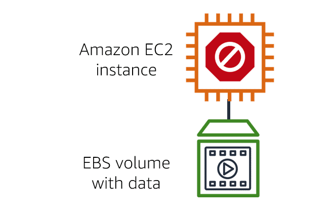
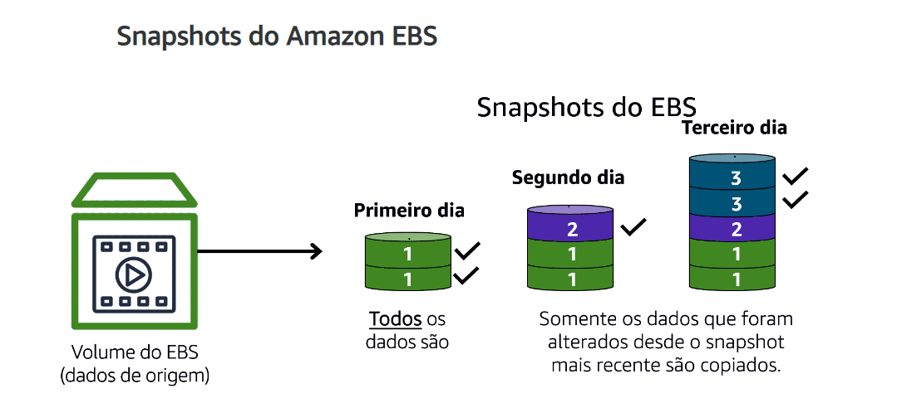

# Armazenamento de instâncias

Fornece armazenamento temporario a nivel de bloco para uma intancia EC2.

É o armazenamento em disco fisicamente anexo ao computador host, portanto tem a vida útil da instância. 
Quando a instancia e encerrada, todos os dados são perdidos.

## Amazon Elastic Block Store ( Amazon EBS)

Serviço que fornece volumes de armazenamento de bloco que voce pode usar com instancias do EC2. Se interromper ou encerrar uma instancia do EC2, todos os dados no volume do EBS anexo permanecerão disponíveis.
 
É importante fazer backup dos dados. Voce pode fazer backups complementares de volumes do EBS criando *Snapshots* do EBS.

Um Snapshot do EBS é um **backup Incremental**. O primeiro backup de um volume copia todos os dados e nos próximos, somente os blocos de dados que foram alterados.