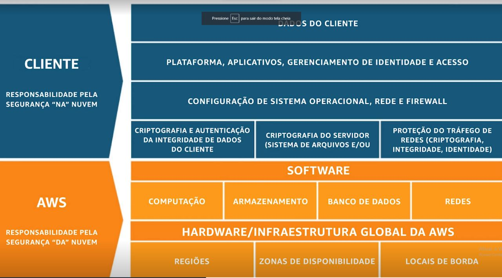

# AWS Shared Responsability Model

## Qual das opções a seguir é responsabilidade do cliente segundo o modelo de responsabilidade compartilhada da AWS?

A) Aplicações de patches na infraestrutura subjacente
B) Segurança física
C) **aplicação de patches nas instâncias do Amazon EC2**
D) Aplicação de patches na infraestrutura de rede

---
**Patch** -> Significa 'correção' ou 'remendo'.Solução mais rápida e econômica para uma empresa resolver algum problema, de forma temporária, até que seja lançada a nova versão do software em questão.

---