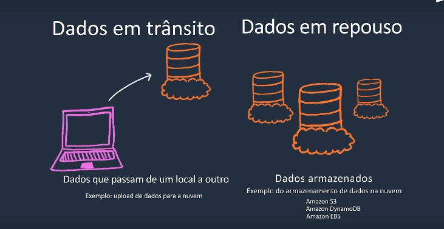

# Cloud Security And Compliance
O AWS Artifact oferece acesso sob demanda a relatórios de segurança e conformidade AWS.

Os requisitos de conformidade variam de acordo com o serviço.

## Criptografia de dados em Transito
Dados que passam de um local a outro.  
Exemplo: upload de dados para a nuvem.

## Criptografia de dados em Repouso
Dados Armazenados.  
Exemplo de armazenamento de dados na nuvem.

- Amazon S3
- Amazon DynamoDB
- Amazon EBS

---
Estar apto a fazer distinções entre os serviços como o Amazon CloudWatch, AWS Cloudtrail e AWS Config

---

## qual é o serviço que auxilia na auditoria de risco com o monitoramento e o registo contínuos da atividade da conta, incluindo as ações dos usuários no AWS Management Console e no SDK da AWS ?

A) Amazon CloudWatch
B) **AWS CloudTrail**
C) AWS Config
D) AWS Health

AWS CloudTrail é um serviço que registra chamadas de API da AWS.

AWS Health mostra continuamente a disponibilidade dos recursos da AWS.