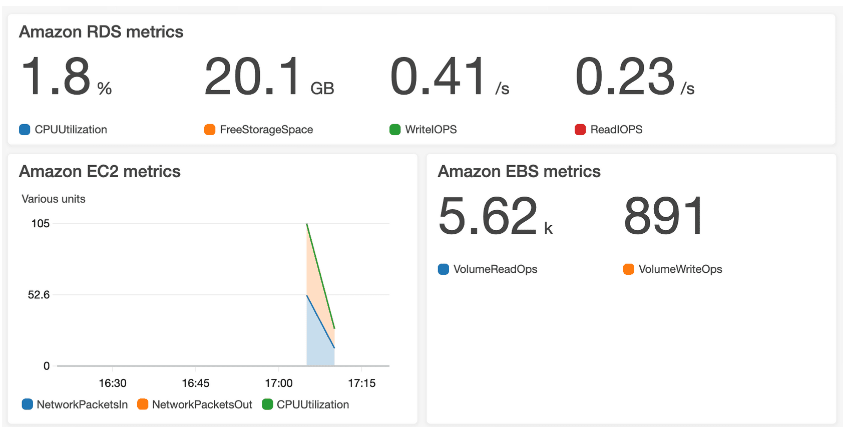

# CloudWatch

Serviço web que permite **monitorar** e **gerenciar** várias métricas e  de acordo com os dados dessas métricas.

## Alarmes do CloudWatch
Com o CloudWatch, você pode criar alarmes que executam ações automaticamente se o valor da métrica ultrapassar ou for inferior a um limite predefinido. 

## Painel do CloudWatch

Permite que voce acesse todas as métricas de seus recursos em um único local.
