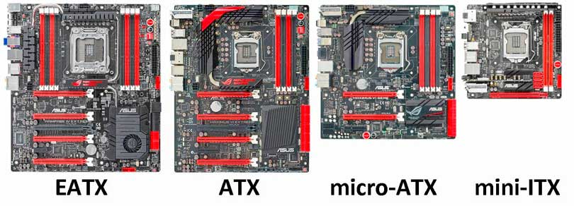

# Placa mãe

## Tamanho 

O formato **micro-ATX** costuma ser o mais versátil, por ser mais comum e ser relativamente compacto, entrando em quase qualquer gabinete e deixando a montagem de máquinas compactas. 

O **ATX** é mais normal em máquinas mais robustas

O **mini-ITX** possibilita montar PCs muito compactos, mas é difícil de ser montado, dependendo do gabinete, e principalmente, tem baixa disponibilidade e modelos. 
