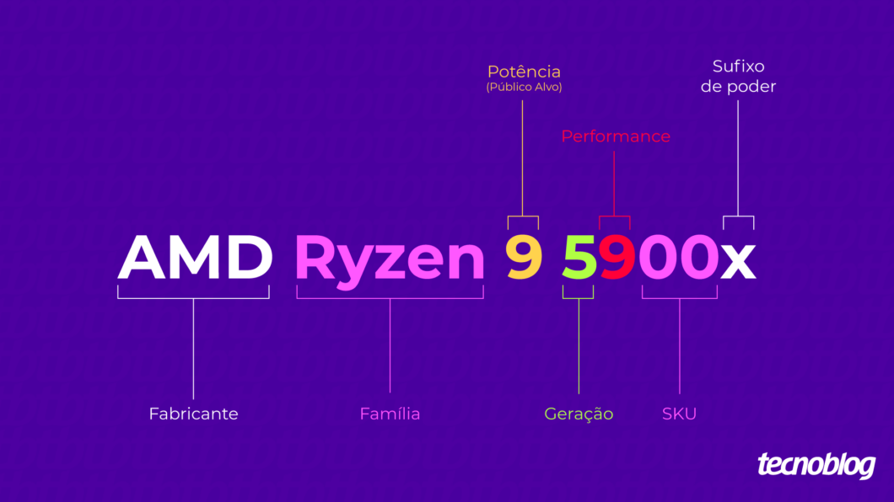

# Processador ADM

## Classe de público alvo

- 3 – Mainstream (para o público em geral que busca eficiência a baixos custos);
- 5 – High Performance (usuários que procuram uma melhor performance);
- 7 – Entusiastas que buscam um desempenho além, para funções complexas;
- 9 – Pro (o máximo de qualidade da AMD oferecido a um valor equivalente).

## Quadra de números

O **primeiro dígito** já foi explicado anteriormente, como sendo identificador da geração do processador e da tecnologia correspondente.

O **segundo dígito** representa o nível de performance do processador, com subdivisões mais específicas:

- < 4 – qualquer valor abaixo de quatro representa performance comum;
- 4, 5, 6 – são dígitos que representam a classe de alta performance de forma crescente;
- 7, 8 – são mais específicos para o grupo de entusiastas divididos em 2 níveis;
- 9 – performance profissional, o que de mais moderno a AMD pode oferecer.

Os **terceiros e quartos dígitos** representam pares, onde o seu significado apresenta velocidades de speed bump ou diferenciador de SKU. Atualmente os mais comuns encontrados são: **00**, **50** ou **80**.

## Sufixo de poder

- **“sem sufixo”** – CPU padrão de desktop;
- **X** – Alta performance, com o XFR;
- **G** – DT com GFX;
- **T** – Desktop de baixo consumo;
- **S** – Desktop de baixo consumo com GFX;
- **H** – Alta performance mobile;
- **U** – Padrão mobile;
- **M** – Mobile de baixo consumo.